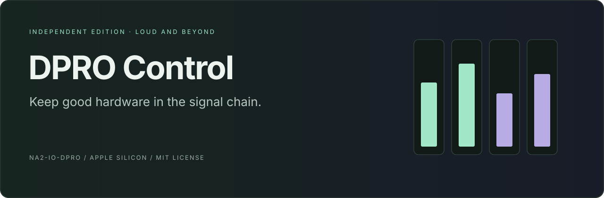
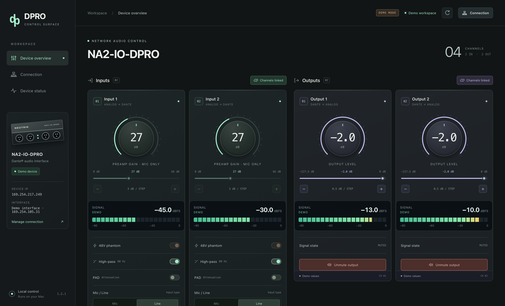

# DPRO Control

**Independent Edition — Loud and Beyond** · Native Apple Silicon

A standalone macOS control app for the **Neutrik NA2-IO-DPRO**. This repository distributes the finished app, its project website and installation documentation. Controller source code is not included.

[Project website](https://maxdavemsp.github.io/dpro-control/) · [Download the app](https://github.com/MaxdaveMsp/dpro-control/releases/download/v1.2.1/DPRO-Control-1.2.1-macOS-arm64.zip) · [Install guide](docs/INSTALL.md)

## Why we made it

Good audio hardware can outlive the software used to control it. We wanted to keep our NA2-IO-DPRO useful with a modern control surface maintained by Loud and Beyond.

Neutrik lists the DPRO as discontinued, with successors dated October 2023. The official controller installed during development was Intel-only. Apple's announced end of general Rosetta support after macOS 27 creates a future compatibility concern for that unchanged build on Apple Silicon. This native ARM app provides an alternative; it does not claim the official app is already unusable or guarantee compatibility with every future OS. [Neutrik product listing](https://www.neutrik.co.uk/product/na2-io-dpro) · [Apple Rosetta announcement](https://developer.apple.com/news/?id=w5ngl9k2)

## Features

- Two inputs: gain, 48 V phantom, 80 Hz HPF, Mic/Line and Line-only PAD.
- Two outputs: attenuation in half-dB steps and independent mute.
- Input/output linking with synchronized settings and readback.
- Four live dBFS meters with stale/offline indication.
- Adapter-based discovery and automatic IP fill.
- Separate Device status view for feedback and session activity.
- Fully local operation with a bundled runtime; no account or cloud required.

## Install

1. Download and extract the app ZIP.
2. Move **DPRO Control.app** into Applications.
3. Open it and allow Local Network access.
4. Disconnect other controllers, select the Ethernet adapter, and connect to the discovered DPRO.

Apple Silicon only. macOS 15 deployment target; tested on macOS 26.5.2. No Python installation or browser is required. The app is ad-hoc signed, not Developer ID signed or Apple notarized. See the [installation guide](docs/INSTALL.md) for app-specific security prompts and troubleshooting.

The app does not configure Dante routing, update firmware, manage AES modes or provide every official-controller feature. Other device models and future macOS versions require separate validation.

## Downloads and credit

Use the named **DPRO-Control-1.2.1-macOS-arm64.zip** release asset to install the app. [Checksums](docs/downloads/SHA256SUMS.txt) are provided. GitHub's automatically generated repository archives contain the website and distribution files, not the controller's development source.

Created by **Loud and Beyond**. Copyright and license notices remain included in the app and archive; see [LICENSE](LICENSE) and [third-party notices](THIRD-PARTY-NOTICES.md). Changing to app-only distribution does not change those included notices.

Independent project, not affiliated with or endorsed by Neutrik or Audinate. Product names identify compatible hardware; trademarks belong to their owners.
